# Myddosome dynamics pipeline

These scripts are for analyzing fluorescent puncta from image processing to statistical analysis. This pipeline has eight steps which may be used modularly. 

These scripts are for analyzing fluorescent puncta acquired using TIRF microscopy. These scripts take raw 16-bit image acquired using NIKON Elements and perform from image processing to statistical analysis. This pipeline has eight steps which run sequentially, but may may also be used modularly. The full pipeline is to be run on two-color data (e.g., GFP and RFP channel data). However, single-color data may be run, but **run_trackmate_anaylsis.m** (step 7) and **ColocalizationSetup.R** must be omitted from the analysis. 

Pipeline described in Deliz-Aguirre, Cao, et al. (2021) MyD88 oligomer size functions as a physical threshold to trigger IL1R Myddosome signaling. J. Cell Biol. https://doi.org/10.1083/jcb.202012071

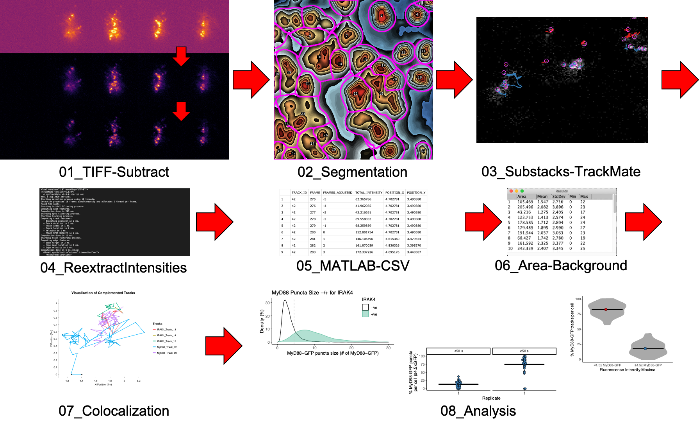
Visual of the Pipeline Workflow

## Getting started

### Prerequisites

#### Operating System (OS))

The operating system must be UNIX-based (e.g., Mac, Linux) due to the path name. VirutalBox (https://www.virtualbox.org/) may be used to run Ubuntu (Linux) inside a Windows computer.

#### ImageJ
**FIJI is Just Image J** (Schindelin, J.; Arganda-Carreras, I. & Frise, E. et al. (2012), "Fiji: an open-source platform for biological-image analysis", Nature methods 9(7): 676-682, PMID 22743772, doi:10.1038/nmeth.2019)
* MorphoLibJ (Legland, D.; Arganda-Carreras, I. & Andrey, P. (2016), "MorphoLibJ: integrated library and plugins for mathematical morphology with ImageJ", Bioinformatics (Oxford Univ Press) 32(22): 3532-3534, PMID 27412086, doi:10.1093/bioinformatics/btw413)
* Trackmate (Tinevez, JY.; Perry, N. & Schindelin, J. et al. (2017), "TrackMate: An open and extensible platform for single-particle tracking.", Methods 115: 80-90, PMID 27713081)
* 8 ramps (RdYlBu).lut (This paper)

#### MATLAB
**MATLAB** (MATLAB. version 9.6.0.1135713 (R2019a). Natick, Massachusetts: The MathWorks Inc.; 2010.)
* Gramm (Morel, (2018). Gramm: grammar of graphics plotting in Matlab. Journal of Open Source Software, 3(23), 568, https://doi.org/10.21105/joss.00568)

#### R
**R version 4.0.2 (2020-06-22)** R Core Team (2020). R: A language and environment for statistical computing. R Foundation for Statistical
Computing, Vienna, Austria. URL https://www.R-project.org/.
* parallel (RStudio Team (2020). RStudio: Integrated Development for R. RStudio, PBC, Boston, MA URL http://www.rstudio.com/)
* stats (RStudio Team (2020). RStudio: Integrated Development for R. RStudio, PBC, Boston, MA URL http://www.rstudio.com/)
* data.table (Matt Dowle and Arun Srinivasan (2019). data.table: Extension of `data.frame`. R package version 1.12.8. https://CRAN.R-project.org/package=data.table)
* ggdark (Neal Grantham (2019). ggdark: Dark Mode for 'ggplot2' Themes. R package version 0.2.1. https://CRAN.R-project.org/package=ggdark)
* ggnewscale (Elio Campitelli (2020). ggnewscale: Multiple Fill and Colour Scales in 'ggplot2'. R package version 0.4.1. https://CRAN.R-project.org/package=ggnewscale)
* ggplot2 (H. Wickham. ggplot2: Elegant Graphics for Data Analysis. Springer-Verlag New York, 2016.)
* ggpmisc (Pedro J. Aphalo (2019). ggpmisc: Miscellaneous Extensions to 'ggplot2'. R package version 0.3.3. ( https://CRAN.R-project.org/package=ggpmisc)
* gridExtra (Baptiste Auguie (2017). gridExtra: Miscellaneous Functions for "Grid" Graphics. R package version 2.3. ( https://CRAN.R-project.org/package=gridExtra)
* hexbin (Dan Carr, ported by Nicholas Lewin-Koh, Martin Maechler and contains copies of lattice functions written ( by Deepayan Sarkar (2020). hexbin: Hexagonal Binning Routines. R package version 1.28.1. ( https://CRAN.R-project.org/package=hexbin)
* meanShiftR (Jonathan Lisic (2018). meanShiftR: A Computationally Efficient Mean Shift Implementation. R package ( version 0.53. https://CRAN.R-project.org/package=meanShiftR)
* openxlsx (Alexander Walker (2018). openxlsx: Read, Write and Edit XLSX Files. R package version 4.1.0. ( https://CRAN.R-project.org/package=openxlsx)
* PerformanceAnalytics (Brian G. Peterson and Peter Carl (2018). PerformanceAnalytics: Econometric Tools for Performance and Risk ( Analysis. R package version 1.5.2. https://CRAN.R-project.org/package=PerformanceAnalytics)
* R.utils (Henrik Bengtsson (2019). R.utils: Various Programming Utilities. R package version 2.9.0.https://CRAN.R-project.org/package=R.utils)
* rlist (Kun Ren (2016). rlist: A Toolbox for Non-Tabular Data Manipulation. R package version 0.4.6.1. https://CRAN.R-project.org/package=rlist)
* scales (Hadley Wickham (2018). scales: Scale Functions for Visualization. R package version 1.0.0. https://CRAN.R-project.org/package=scales)
* svglite( Hadley Wickham, Lionel Henry, Thomas Lin Pedersen, T Jake Luciani, Matthieu Decorde and Vaudor Lise ( (2020). svglite: An 'SVG' Graphics Device. R package version 1.2.3. https://CRAN.R-project.org/package=svglite)
* tictoc (Sergei Izrailev (2014). tictoc: Functions for timing R scripts, as well as implementations of Stack and ( List structures.. R package version 1.0. https://CRAN.R-project.org/package=tictoc)
* tidyverse (Hadley Wickham (2017). tidyverse: Easily Install and Load the 'Tidyverse'. R package version 1.2.1. https://CRAN.R-project.org/package=tidyverse)
* viridis (Simon Garnier (2018). viridis: Default Color Maps from 'matplotlib'. R package version 0.5.1. ( https://CRAN.R-project.org/package=viridis)
* zoo (Achim Zeileis and Gabor Grothendieck (2005). zoo: S3 Infrastructure for Regular and Irregular Time Series. Journal of Statistical Software, 14(6), 1-27. doi:10.18637/jss.v014.i06)

**RStudio** (RStudio Team (2020). RStudio: Integrated Development for R. RStudio, PBC, Boston, MA URL http://www.rstudio.com/)

**NOTE:** All required packages install themselves automatically on Step 8: UserInput.R during the "Setup" phase 

#### OPTIONAL: Sample Data Set (Both Input and Output)
Download sample data set with inputs and outputs for each step from https://zenodo.org/.

## Pipeline

For this pipeline, we contain the workflow inside a folder called "ImageAnalysisWorkflow". The path leading to "ImageAnalysisWorkflow" will be referred to in this document as "~". The image names will be refered to as *ImageName*. "Experimental" images are those which capture live cells. "Calibration" images are those of purified monomers. The calibration images must be captured under the same conditions (e.g., same exposure, frame rate) as the experimental images. All images were captured using a TIRF microscope.

### 00_Setup
---
We use the following folder structure for ease of use:

* 00_Setup
    * Calibrations
    * Darkfields
    * Input
* 01_TIFF-Subtract
* 02_Segmentation
* 03_Substacks-TrackMate
* 04_ReextractIntensities
* 05_MATLAB-CSV
* 06_Area-Background
* 07_Colocalization
* 08_Analysis

**From steps 01-08**, we recommend naming the subfolders based on cell lines and which image channels were captured. For example, a folder named "MyD88 IRAK4" only imaged MyD88-GFP and IRAK4-mScarlet. Supposing this same cell line was used, but IL1-Cy5 was imaged, then we recommend creating another folder called "IL1 MyD88 IRAK4" so that batches are run easier in ImageJ. The cell line folder may be referred to as "CellLineFolder" in this document.

### 01_TIFF-Subtract.ijm (ImageJ)
---
* Converts nd2 files to 16-bit TIFF stack. Separates channels into different TIFF files.
* This script is also used to remove background intensity values that arise from darkframe noise and non-specific cytosolic fluorescence which is calculated using a median background filter.
    * The darkframe is the camera noise. It is generated by closing the camera shutter and acquiring 5000 frames at the same exposure as the experimental images. Then, these frames are averaged using the mean. Lastly, this mean image is subtracted from the "experimental" and "calibration" images. The more frames, the better. However, the limiting factor is the computer memory. This may be overcome by averaging averages.
    * The median background was calculated for a 25-px (aproximately 3.67 µm) radius. This number correspond roughly to the cell radius.

#### Input
* ND2 image file of up to 3 channels . If using TIFF instead of ND2,
    * Prevent `splitBioFormatToTif(inFullname, dir);` from running by adding `//` at the beggining of the line
    * If original TIFF image was a single channel, use ***ImageName.tif***
    * If multiple channels were acquired, separate channels by using ***ImageName C=0.tif***, ***ImageName C=1.tif*** or ***ImageName C=2.tif***, as applicable
    * Ensure that the aforementioned TIFF images are inside a folder called ***ImageName***
    * Place at "~/ImageAnalysisWorkflow/01_TIFF-Subtract/CellLineFolder", or "~/ImageAnalysisWorkflow/01_TIFF-Subtract/MyD88 IRAK4" for the sample dataset
* Darkframe image placed at "~/ImageAnalysisWorkflow/00_Setup/Darkfields"

#### Run
Run each batch based on the CellLineFolder name.

After pressing run in ImageJ, a dialog box opens up as shown below:

For the calibration, 
For the experimental data, 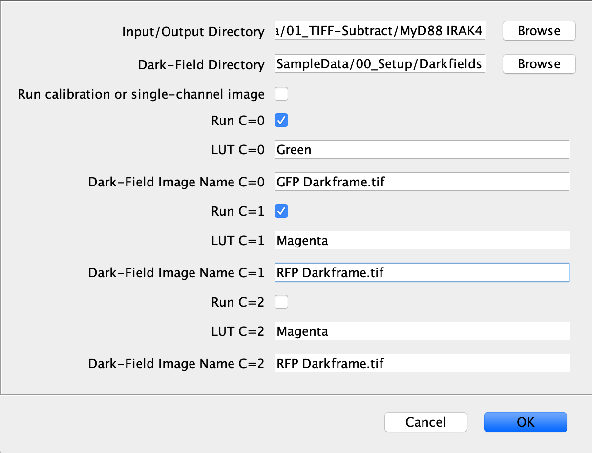

Alternatively, variables may be entered manually as shown below, though lines starting with `#@ ` must be completely removed.

```
// Directory of images
dir = "~/ImageAnalysisWorkflow/01_TIFF-Subtract/CellLineFolder";

// Dark frame directory
dir_df = "~/ImageAnalysisWorkflow/00_Setup/Darkfields";

// Is a calibration or one channel image
runCalibration = false;

// Run channel 0. Specify details of 
runC0 = true;
LUT_0 = "Green";
df_0 = "GFP Darkframe.tif";

// Run channel 1
runC1 = true;
LUT_1 = "Magenta";
df_1 = "RFP Darkframe.tif";

// Run channel 2
runC2 = false;
LUT_2 = "Cyan";
df_2 = "Cy5 Darkframe.tif";
```

#### Output
* Creates a folder ***ImageName*** and under it:
    * A one-channeled image saved under one ND2 file will have one outputs ending as ***ImageName.tif***
    * A multi-channel image saved under one ND2 file will have all channels split, and the output will end as ***ImageName C=0.tif***, [...], ***ImageName C=N.tif***
    * A darkframe removed image ending as ***-DFRm.tif***
    * A median-filtered, darkframe-subtracted image of 25x25 pixels ending as ***-Median.tif***
    * A median-subtracted, darkframe-subtracted image ending as ***-MedRm.tif***
    * The image properties, saved as ***Metadata.txt***
    
#### Sample Structure
* 00_Setup
    * Darkfields
* 01_TIFF-Subtract
    * GFP calibration
        * GFP calibration.nd ***(Input)***
        *  GFP calibration.tif ***(Output)***
        *  GFP calibration-DFRm.tif ***(Output)***
        *  GFP calibration-MedRm.tif ***(Output)***
    * MyD88 IRAK4
        * MyD88-GFP IRAK4-mScarlett 002
            * MyD88-GFP IRAK4-mScarlett 002.nd ***(Input)***
            * MyD88-GFP IRAK4-mScarlett 002 C=0.tif ***(Output)***
            * MyD88-GFP IRAK4-mScarlett 002 C=0-DFRm.tif ***(Output)***
            * MyD88-GFP IRAK4-mScarlett 002 C=0-MedRm.tif ***(Output)***
            * MyD88-GFP IRAK4-mScarlett 002 C=1.tif ***(Output)***
            * MyD88-GFP IRAK4-mScarlett 002 C=1-DFRm.tif ***(Output)***
            * MyD88-GFP IRAK4-mScarlett 002 C=1-MedRm.tif ***(Output)***

### 02_Segmentation.ijm (ImageJ)
---

Segments cells using a marker-controlled watershed segmentation (implemented with the MorphoLibJ ImageJ plugin). This script uses a maximum projection of the channel of the reference protein as the marker. It blurs and dilates the image to capture both, the marker and mask.

#### Input
* TIFF image of reference protein (either ***ImageName.tif***, ***ImageName C=0.tif*** or ***ImageName C=1.tif***) inside a folder called ***ImageName***
* Custom LUT, "8 ramps (RdYlBu).lut" contained in the folder "02_Segmentation LUT (Import to FIJI)", to ImageJ's LUT folder 

#### Run
Run each batch based on the CellLineFolder name.

After pressing run in ImageJ, a dialog box opens up as shown below:


Alternatively, variables may be entered manually as shown below, though lines starting with `#@ ` must be completely removed.

```
// Directory of images
dir = "~/ImageAnalysisWorkflow/02_Segmentation/CellLineFolder";

// Use channel 0 (C=0) for segmentation
runSegmentationC1 = true;

// Use channel 1 (C=1) for segmentation
runSegmentationC1 = false;

// Only one channel available. Use this for segmentation 
runSegmentation = false;

// Invert masked region
runInversion = false;
```

**NOTE**: Sometimes FIJI interprets the mask as the region where there's no cells (see image below).


To correct this, set:


```
// Invert masked region
runInversion = true ;
```

#### Output
* A file called ***ImageName.zip*** which contains the ROI of all cells in the image
* An image called ***ImageName_SegInput.tif*** which has the input for MorphoLibJ
* An image called ***ImageName_SegMarker.tif*** which is the marker based on the brightest regions of the reference protein channel
* An image called ***ImageName_SegMask.tif*** which is the mask based on a blurred reference protein channel
* An image called ***ImageName_SegWatershed.tif*** which delineates the cell boundaries
* An image called ***ImageName_SegOverlay.tif*** which overlays the cell boundaries against the reference image and with a LUT where red represents the brightest regions and blue the darkest

#### Sample Structure

* 02_Segmentation
    * MyD88 IRAK4
        * MyD88-GFP IRAK4-mScarlett 002
            * MyD88-GFP IRAK4-mScarlett 002 C=0-DFRm.tif ***(Input)***
            * MyD88-GFP IRAK4-mScarlett 002_SegInput.tif ***(Output)***
            * MyD88-GFP IRAK4-mScarlett 002_SegMarker.tif ***(Output)***
            * MyD88-GFP IRAK4-mScarlett 002_SegMask.tif ***(Output)***
            * MyD88-GFP IRAK4-mScarlett 002_SegWatershed.tif ***(Output)***
            * MyD88-GFP IRAK4-mScarlett 002_SegOverlay.tif ***(Output)***
            * MyD88-GFP IRAK4-mScarlett 002.zip  ***(Output)***

### 03_Substacks-TrackMate.ijm (ImageJ)
---

* Creates darkframe and median substacks for individual cell identified from the segmentation results
* Runs TrackMate on the substacks

#### Input

* Inside a folder called "ImageName",
    * A darkframe removed image ending as ***-DFRm.tif***
    * A median-subtracted, darkframe-subtracted image ending as ***-MedRm.tif***.  It must be inside a folder called "ImageName"
    * A zip file containing the ROIs, ***ImageName.zip***. It must be inside a folder called "ImageName"

#### Run

Run each batch based on the CellLineFolder name.

After pressing run in ImageJ, a dialog box opens up as shown below:

For the calibration, 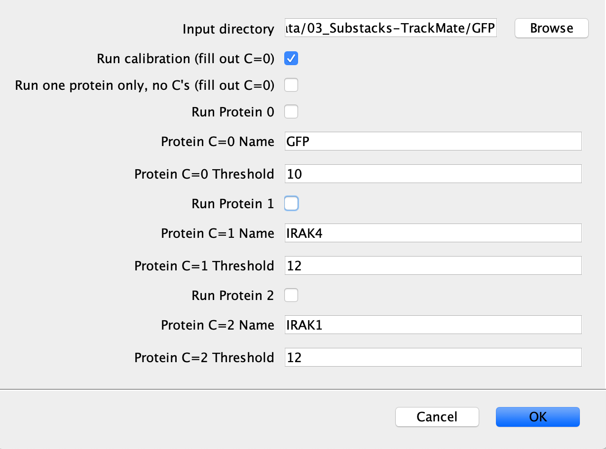
For the experimental data, 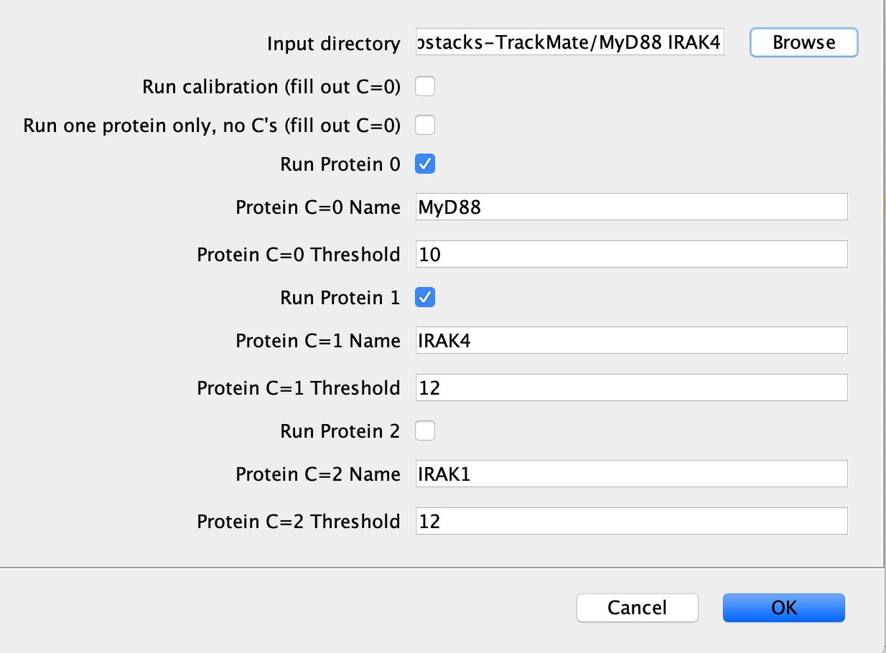

Alternatively, variables may be entered manually as shown below, though lines starting with `#@ ` must be completely removed.

```
// Directory of images
dir = "~";

// Input is calibration images
runCalibration = false;

// Input is single-channel image
runProtein = false;

// Include C=0 as input
runProtein0 = false;
protein0 = "Cy5";
protein0_threshold = "10";

// Include C=1 as input
runProtein1 = true;
protein1 = "GFP";
protein1_threshold = "10";

// Include C=2 as input
runProtein2 = true;
protein2 = "RFP";
protein2_threshold = "12";
```

**NOTE:** Ensure that area and mean are included in the ImageJ measurements. We used the following thresholds: 10 for MyD88 and 12 for IRAK.

#### Output
* Subfolders named ***Cell_1***, ***Cell_2***, [...], ***Cell_N*** inside folder named "ImageName". Inside these subfolders, there will be:
    * A darkframe removed cell image called ***ProteinName.tif***
    * A median-subtracted, darkframe-subtracted cell image called ***ProteinName_MED.tif***
    * An xml file called ***ProteinName.xml*** which contains the TrackMate output (e.g., coordinates, intensity, timepoint)
* Files ending in ***_Measurements.txt*** containing ROI measurements, including the mean intensity of the first frame, as shown below:

| Area | Mean    | StdDev | Min   | Max |    |
|------|---------|--------|-------|-----|----|
| 1    | 105.469 | 1.547  | 2.716 | 0   | 22 |
| 2    | 205.496 | 1.659  | 2.790 | 0   | 23 |
| 3    | 43.216  | 1.271  | 2.403 | 0   | 17 |

#### Sample Structure
* 03_Substacks-TrackMate
    * GFP calibration
        * GFP calibration-DFRm.tif ***(Input)***
        * GFP calibration-MedRm.tif ***(Input)***
        * Cell_1
            * GFP_MED.tif ***(Output)***
            * GFP.xml ***(Output)***
        * GFP calibration GFP_MED_Measurements.txt ***(Output)***
    * MyD88 IRAK4
        * MyD88-GFP IRAK4-mScarlett 002
            * MyD88-GFP IRAK4-mScarlett 002.zip ***(Input)***
            * MyD88-GFP IRAK4-mScarlett 002 C=0-DFRm.tif ***(Input)***
            * MyD88-GFP IRAK4-mScarlett 002 C=0-MedRm.tif ***(Input)***
            * MyD88-GFP IRAK4-mScarlett 002 C=1-DFRm.tif ***(Input)***
            * MyD88-GFP IRAK4-mScarlett 002 C=1-MedRm.tif ***(Input)***
            * Cell_N
                * MyD88.tif ***(Output)***
                * MyD88_MED.tif ***(Output)***
                * MyD88.xml ***(Output)***
                * IRAK4.tif ***(Output)***
                * IRAK4_MED.tif ***(Output)***
                * IRAK4.xml ***(Output)***
            * MyD88-GFP IRAK4-mScarlett 002 IRAK4_DF_Measurements.txt ***(Output)***
            * MyD88-GFP IRAK4-mScarlett 002 IRAK4_MED_Measurements.txt ***(Output)***
            * MyD88-GFP IRAK4-mScarlett 002 MyD88_DF_Measurements.txt ***(Output)***
            * MyD88-GFP IRAK4-mScarlett 002 MyD88_MED_Measurements.txt ***(Output)***

### 04_ReextractIntensities/ReextractIntensities_04.m (MATLAB)
---

Imports coordinates generated by TrackMate. It then obtains the fluorescence intensity of the puncta from the median-filtered image from a 3x3 pixel region and exports it as a table.

#### Input
* Median-subtracted image of the cell (***ProteinName_MED.tif***)
* XML output of TrackMate (***ProteinName.xml***)
* Table called **xml2csv.xlsx** which contains which images to process, as shown below:

| Path | PathUNIX | Protein | Cells |
| ------------- | ------------- | ------------- | ------------- |
| \\\~\ImageAnalysisWorkflow\04_ReextractIntensities\CellLineFolder\ImageName | ~/ImageAnalysisWorkflow/04_ReextractIntensities/CellLineFolder/ImageName | ProteinName | 30 |

This table may be generated using the script **04_PreReextractIntensities.R** with the following lines in its script,

```
INPUT_DIRECTORY = c(
  "~/ImageAnalysisWorkflow/04_ReextractIntensities"
)

OUTPUT_DIRECTORY = "~/ImageAnalysisWorkflow/00_Setup"
```

#### Run
All folders (CellLineFolder) may run together.

All `Input` lines must indicate the path to the **xml2csv** table,
```
% Input table
Input =  readtable('~/ImageAnalysisWorkflow/00_Setup/xml2csv.xlsx');
```

#### Output
* A table called ***ProteinName spots in tracks statistics.csv*** with details as shown below:

| XML  |  Image Name |  | |  | |  |
|--------------------------------------------------------------------------------------------------------------------------------------|-------------------------------------------------------------------------------------------------------------------------------------------|------------|-------------|------------|-------------|--------------|
|  ~/ImageAnalysisWorkflow/04_ReextractIntensities/CellLineFolder/ImageName/Cell_N/ProteinName.xml |  ~/ImageAnalysisWorkflow/04_ReextractIntensities/CellLineFolder/ImageName/Cell_N/ProteinName_MED.tif  |  | |  | |  |
|  | |  | |  | |  |
| Serial No. |  Track Name |  Frame No. |  Relative t |  Intensity |  Position X |  Position Y  |
|  | |  | |  | |  |
| 1  |  Track_103  |  | |  | |  |
| 1  | | 406  | -5  | 97.781595  | 5.587576  | 12.838095  |
| 1  | | 407  | -4  | 89.559725  | 5.587576  | 12.838095  |
| 1  | | 408  | -3  | 74.897495  | 5.587576  | 12.838095  |

#### Sample Structure
* 00_Setup
    * xml2csv.xlsx ***(Input)***
* 04_ReextractIntensities
    * GFP calibration
        * Cell_1
            * GFP_MED.tif ***(Input)***
            * GFP.xml ***(Input)***
            * GFP spots in tracks statistics.csv ***(Output)***
    * MyD88 IRAK4
        * MyD88-GFP IRAK4-mScarlett 002
            * Cell_N
                * MyD88_MED.tif ***(Input)***
                * MyD88.xml ***(Input)***
                * MyD88 spots in tracks statistics.csv ***(Output)***
                * IRAK4_MED.tif ***(Input)***
                * IRAK4.xml ***(Input)***
                * IRAK4 spots in tracks statistics.csv ***(Output)***

### 05_MATLAB-CSV.R (R)
---

Make table the output of ReextractIntensities_04.m more user friendly and easily imported into R

#### Input
* A table called ***ProteinName spots in tracks statistics.csv*** with details as shown below

| XML  |  Image Name |  | |  | |  |
|--------------------------------------------------------------------------------------------------------------------------------------|-------------------------------------------------------------------------------------------------------------------------------------------|------------|-------------|------------|-------------|--------------|
|  ~/ImageAnalysisWorkflow/04_ReextractIntensities/CellLineFolder/ImageName/Cell_N/ProteinName.xml |  ~/ImageAnalysisWorkflow/04_ReextractIntensities/CellLineFolder/ImageName/Cell_N/ProteinName_MED.tif  |  | |  | |  |
|  | |  | |  | |  |
| Serial No. |  Track Name |  Frame No. |  Relative t |  Intensity |  Position X |  Position Y  |
|  | |  | |  | |  |
| 1  |  Track_103  |  | |  | |  |
| 1  | | 406  | -5  | 97.781595  | 5.587576  | 12.838095  |
| 1  | | 407  | -4  | 89.559725  | 5.587576  | 12.838095  |
| 1  | | 408  | -3  | 74.897495  | 5.587576  | 12.838095  |

#### Run

All folders (CellLineFolder) may run together.

```
# Directory containing MATLAB's csv tables 
DIRECTORY = "~/ImageAnalysisWorkflow/05_MATLAB-CSV.R"

#Proteins available
PROTEINS = c("ReferenceProtein", "Protein1", "Protein2", "CalibrationProtein1", "CalibrationProtein2")

# Convention: PROTEINS + space + FILE_NAME
FILE_NAME = "spots in tracks statistics.csv"
```

#### Output
* A table called ***Reformated ProteinName spots in tracks statistics.csv*** with details as shown below:

|   | TRACK_ID | FRAME | FRAMES_ADJUSTED | TOTAL_INTENSITY | POSITION_X | POSITION_Y |
|---|----------|-------|-----------------|-----------------|------------|------------|
| 1 | 103      | 406   | -5              | 97.781595       | 5.587576   | 12.838095  |
| 2 | 103      | 407   | -4              | 89.559725       | 5.587576   | 12.838095  |
| 3 | 103      | 408   | -3              | 74.897495       | 5.587576   | 12.838095  |

### 06_Area-Background.R (R)
---

Makes a table of all cells, recording their path, area and initial intensity (i.e., "background"). This table shall also serve as the input for all scripts under 08_Analysis

#### Input

* File ending in ***_Measurements.txt*** containing ROI measurements, including the mean intensity of the first frame, as shown below:

| Area | Mean    | StdDev | Min   | Max |    |
|------|---------|--------|-------|-----|----|
| 1    | 105.469 | 1.547  | 2.716 | 0   | 22 |
| 2    | 205.496 | 1.659  | 2.790 | 0   | 23 |
| 3    | 43.216  | 1.271  | 2.403 | 0   | 17 |

#### Run

* Calibrations and experimental images must run in separate batches to generate separate tables. Adapt the following lines, accordingly:
    * `PROTEINS = c("ProteinName")`
    * `OUTPUT_NAME = Experimental` or `OUTPUT_NAME = Calibration`

```
# Path containing setup and images
TOP_DIRECTORY = "~/ImageAnalysisWorkflow"
# Path to images
INPUT_DIRECTORY = "06_Area-Background"
# Path to output
OUTPUT_DIRECTORY = "00_Setup"
# Protein Names
PROTEINS = c("MyD88", "IRAK4", "IRAK1", "GFP", "RFP")
# Input table name
INPUT_NAME = "_MED_Measurements.txt"
# Output table name
OUTPUT_NAME = "Experimental"

#Thresholds
REFERENCE_PROTEIN = "MyD88"
REFERENCE_MAX_INTENSITY_THRESHOLD = 4.5
REFERENCE_LIFETIME_THRESHOLD = 50
REFERENCE_STARTING_INTENSITY_THESHOLD = 2.5

OTHER_MAX_INTENSITY_THRESHOLD = 2.67
OTHER_LIFETIME_THRESHOLD = 25
OTHER_STARTING_INTENSITY_THESHOLD = 1.67

```

#### Output
* A table called ***Date Experimental/Calibration Combined Measurements.csv*** with the data below:

| Cell | Area | Mean | StdDev | Min | Max | Container | LIGAND_DENSITY | COHORT | IMAGE | DATE | CELL | AREA | PROTEIN | FLUOROPHORE | PROTEIN_BACKGROUND_CELL | PROTEIN_INTENSITY | PROTEIN_SD | FPS |
|-|-|-|-|-|-|-|-|-|-|-|-|-|-|-|-|-|-|
| 1 | 105.469 | 1.547 | 2.716 | 0 | 22 | CellLineFolder |  | CellLineFolder | ImageName |  | 1 | 105.469 | Protein | Fluorophore | 1.547 |  |  |  |
| 2 | 205.496 | 1.659 | 2.79 | 0 | 23 | CellLineFolder |  | CellLineFolder | ImageName |  | 2 | 205.496 | Protein | Fluorophore |  1.659 |  |  |  |
| 3 | 43.216 | 1.271 | 2.403 | 0 | 17 | CellLineFolder |  | CellLineFolder | ImageName |  | 3 | 43.216 | Protein | Fluorophore |  1.271 |  |  |  |

#### Structure
* 00_Setup
    * 2020-08-24 Experimental Combined Measurements.csv ***(Output)***
    * 2020-08-24 Calibration Combined Measurements.csv ***(Output)***
* 06_Area-Background
    * GFP calibration
        * GFP calibration GFP_MED_Measurements.txt ***(Input)***
    * MyD88 IRAK4
        * MyD88-GFP IRAK4-mScarlett 002
            * MyD88-GFP IRAK4-mScarlett 002 IRAK4_MED_Measurements.txt ***(Input)***
            * MyD88-GFP IRAK4-mScarlett 002 MyD88_MED_Measurements.txt ***(Input)***

### 07_Colocalization/run_trackmate_anaylsis.m (MATLAB)
---


* Colocalizes puncta from different channels
* Puncta must meet ceirtain criteria, including:
    * Maximum distance
    * Minimum association time
    * Minimum dwell time criteria

#### Input
* Two xml files called ***ProteinName1.xml*** and ***ProteinName2.xml*** which contain the TrackMate outputs (e.g., coordinates, intensity, timepoint)
* Table called **Colocalization.xlsx** which contains which images to process, as shown below:

| PATH | CELLS | PROTEIN1 | PROTEIN2 |
|-|-|-|-|
| ~/ImageAnalysisWorkflow/07_Colocalization/CellLineFolder/ImageName | 32 | Protein1 | Protein2 |
| ~/ImageAnalysisWorkflow/07_Colocalization/CellLineFolder/ImageName | 32 | Protein2 | Protein1 |

This table may be generated using the script **07_PreColocalization.R** with the following lines in its script,

```
INPUT_DIRECTORY = "~/ImageAnalysisWorkflow/07_Colocalization"
OUTPUT_DIRECTORY = "~/ImageAnalysisWorkflow/00_Setup"
```
**NOTE:** Do not end path with "/"

#### Run
All folders (CellLineFolder) may run together.

```
% Maxmimum distance between puncta
maximum_distance = 0.25;

% Minimum time puncta are associated
minimum_association_time = 3;

% Minimum dwell time of the punctum
minimum_dwell_time = 2;

nbins = 50;

% Input table
Input = readtable('\\path\Colocalization.xls');
```

#### Output
* 2D_Plots
    * Colocalized_tracks_N.pdf, a scatter (xy) plot of how puncta colocalized with lines showing puncta trajectory
* 3D_Plots
    * N.fig, a 3-D scatter (xyt) plot of how puncta colocalized with lines showing puncta trajectory over time
* Analysis
    * Displacement_independent_comlemented_molecules.pdf, a bar plot comparing how far complemented and independent molecules traveled
    * Distribution_time_association.pdf, a scatter plot of the time association of complemented molecules
    * Dwell_time_independent_complemented.pdf, a scatter plot of the dwell time of complemented and independent molecules
    * max_intensity.pdf, a scatter plot of the max intensity vs frame
    * Ref_tracks_dwelltime.pdf, scatter plot of all tracks (line) by dwell time (color)
    * REF_TRACKS_LINEARITY_OF_FORWARD_PROGRESSION.pdf
    * REF_TRACKS_MAX_DISTANCE_TRAVELED.pdf
    * REF_TRACKS_TOTAL_DISTANCE_TRAVELED.pdf
    * SNR_related_tracks.pdf, a line graph of the signal to noise ratio of various tracks
    * Spot_density.pdf, a histogram of spot count vs time
    * Spots_location_tracks.pdf, a 2D density plot of the coordinates (xy) by tracks count (color)
    * Spots_location.pdf, a 2D density plot of the coordinates (xy) by spot count (color)
    * Spots_tracks_concentration.pdf, a histogram of spot count vs time
    * Total_intensity_related_not_related.pdf, a bar plot comparing the intensity of complemented and independent molecules
    * Totaldwelltime_other.pdf, scatter plot of all tracks (line) by dwell time (color) of the non-reference protein
    * tracks_dwell_time.pdf, scatter plot of all tracks (line) by dwell time (color) of the reference protein
    * TRACKS_LINEARITY_OF_FORWARD_PROGRESSION.pdf
    * TRACKS_MAX_DISTANCE_TRAVELED.pdf
    * TRACKS_TOTAL_DISTANCE_TRAVELED.pdf
* Link_cost_plot
    * N.pdf, link-cost plot of complemented tracks
* log.txt, a log of the colocalization
* statistics.txt, average association time and dwell times
* supporting_track_data.xlsx, a spreadsheet with various sheets, including:
    * distance, a table of tracks by colocalization group
    * edges, a list of pucnta coordinates with link cost
    * track_spots, spot data from the xml file generated TrackMate
    * all_spots, spot data from the xml file generated TrackMate
    * tracks, number of spots per track
* track_variables.mat, same data as **supporting_track_data.xlsx** but in .m (MATLAB) format

#### Sample Structure
* 00_Setup
    * Colocalization.xlsx ***(Input)***
* 07_Colocalization
    * MyD88 IRAK4
        * MyD88-GFP IRAK4-mScarlett 002
            * Cell_N
                * MyD88.xml ***(Input)***
                * IRAK4.xml ***(Input)***
                * Protein2_Protein1 (and the same but "Protein1_Protein2")
                    * 2D_Plots
                        * Colocalized_tracks_N.pdf ***(Output)***
                    * 3D_Plots
                        * N.fig
                    * Analysis
                        * TRACKS_TOTAL_DISTANCE_TRAVELED.pdf ***(Output)***
                        * Distribution_time_association.pdf ***(Output)***
                        * Dwell_time_independent_complemented.pdf ***(Output)***
                        * Halflife ***(Output)***
                        * max_intensity.pdf ***(Output)***
                        * Ref_tracks_dwelltime.pdf ***(Output)***
                        * REF_TRACKS_LINEARITY_OF_FORWARD_PROGRESSION.pdf ***(Output)***
                        * REF_TRACKS_MAX_DISTANCE_TRAVELED.pdf ***(Output)***
                        * REF_TRACKS_TOTAL_DISTANCE_TRAVELED.pdf ***(Output)***
                        * SNR_related_tracks.pdf ***(Output)***
                        * Spot_density.pdf ***(Output)***
                        * Spots_location_tracks.pdf ***(Output)***
                        * Spots_location.pdf ***(Output)***
                        * Spots_tracks_concentration.pdf ***(Output)***
                        * Total_intensity_related_not_related.pdf ***(Output)***
                        * Totaldwelltime_other.pdf ***(Output)***
                        * tracks_dwell_time.pdf ***(Output)***
                        * TRACKS_LINEARITY_OF_FORWARD_PROGRESSION.pdf ***(Output)***
                        * TRACKS_MAX_DISTANCE_TRAVELED.pdf ***(Output)***
                        * Displacement_independent_comlemented_molecules.pdf ***(Output)***
                    * Link_cost_plot
                        * 1.pdf ***(Output)***
                    * log.txt ***(Output)***
                    * statistics.txt ***(Output)***
                    * supporting_track_data.xlsx ***(Output)***
                    * track_variables.mat ***(Output)***

### 08_Analysis (R)
---
Analyzes various parameters of the puncta to produce outputs as outlined below.

##### Conventions
* Variable names are in all caps and separated by underscores ("_"). For example, `LIGAND_DENSITY`
* Table names have no separators and have the first word capitalized. For example, `InputData`
* Custom functions start with `my.fx`, where fx is the function name in lowercase with no separators.
* Loops
* Loops follow the following level hierarchy: (1) Ligand density category, (2) Group, (3) Cohort, (4) Image, (5) Cell and (6) Protein. 
    * Each loop is called by `DescriptionLevelFx`, where "Description" summarizes in a word or two what the function does, the level is as aforementioned (e.g., CalibrationListFx)
    * `LevelX` is equal to a number, where the "level" is as aforementioned
    * `mclapply` is used to run loops in parallel
* Inputs are typically `*.csv`
* Outputs are typically saved as `*.csv.gz`.
* `tryCatch` is implemented to handle errors while looping. It helps skip cells with no activity.
* For variables with the **-_CAT** suffix, 0 is false/negative and 1 is true/positive. Usually compared against a *_THRESHOLD** of a similar prefix (e.g., **MAX_NORMALIZED_INTENSITY** is compared to **MAX_INT_THRESHOLD** and the result is saved to **MAX_INT_CAT**)
* Universal IDs are separated with "..." and sorted from top to bottom hierarchical level
 
#### UserInput.R and Setup.R

This script asks the users for the parameters of the analysis, as well as which analysis to run. The **Setup.R** script sets the environment up, loading libraries and custom functions. The **Setup.R** also produces summaries of the **R_Input.csv** table.

##### Input
* Variables as listed on **UserInput.R** (description above each variable)
* Table called **R_Input.csv** located at "00_Setup" which contains which images to process, as shown below:

| LIGAND_DENSITY | COHORT | IMAGE | DATE | CELL | AREA | PROTEIN | FLUOROPHORE | PROTEIN_BACKGROUND_CELL | PROTEIN_INTENSITY | PROTEIN_SD | ASSEMBLED_COMPLEX_SIZE | MAX_INTENSITY_THRESHOLD | LIFETIME_THRESHOLD | STARTING_INTENSITY_THESHOLD | FPS |
|-|-|-|-|-|-|-|-|-|-|-|-|-|-|-|-|
| 11.5874656 | IL-1 MyD88 |MyD88-GFP 001 | 20190501 | 1 | 1287.29 | MyD88 | GFP | 2.997 | 69.5237342 | 37.6514148 | 6 | 4.5 | 50 | 2.5 | 1 |
| 11.707989 | IL-1 MyD88 | MyD88-GFP 002 | 20190510 | 1 | 150.513 | MyD88 | GFP | 2.395 | 64.1468501 | 25.077296 | 6 | 4.5 | 50 | 2.5 | 1 |
| 11.707989 | MyD88 | MyD88-GFP 003 | 20190503 | 1 | 112.482 | MyD88 | GFP | 1.938 | 63.892445 | 17.6973187 | 6 | 4.5 | 50 | 2.5 | 1 |

* Table called **Calibrations.csv** located at "00_Setup"
    * Add column "KEEP" with "0" meaning the calibration won't be used and "1" to use
    * If "KEEP" is blank, image will be analyzed during **CalibrationSetup.R** and compute other columns, including:
        * SPOTS
        * PROTEIN_CALIBRATION_MEAN
        * PROTEIN_CALIBRATION_SD
        * PROTEIN_CALIBRATION_SE
    * Table must contain the following:
    
| PROTEIN_CALIBRATION | PROTEIN | PROTEIN_CALIBRATION_DATE | PROTEIN_CALIBRATION_BACKGROUND | SPOTS | KEEP | PROTEIN_CALIBRATION_MEAN | PROTEIN_CALIBRATION_SD | PROTEIN_CALIBRATION_SE |
|-|-|-|-|-|-|-|-|-|
| Mock GFP Calibration 001 | GFP | 20200101 | 0.359 | 16 | 0 | 27.185845 | 5.462177945 | 0.341386122 |
| Mock GFP Calibration 002 | GFP | 20200101 | 0.89 | 21 | 1 | 31.47756614 | 5.320319398 | 1.160988874 |
| Mock GFP Calibration 003 | GFP | 20200102 | 1.877 |  |  |  |  |  |

These tables may be generated using the script **06_Area-Background.R**. Do note that **Calibrations.csv** needs additional columns as aforementioned.

#### Run

```
#Folder containing all scripts
SCRIPTS_DIRECTORY = "~/image-analysis/Final/08_Analysis"
#Folder containing all data
TOP_DIRECTORY = "~/ImageAnalysisWorkflow"
#Folder containing calibration and input data
SETUP_FOLDER = "00_Setup"
#Folder containing all images
ANALYSIS_FOLDER = "08_Analysis"
#List of images to analyze
INPUT_DATA = "R_Input.csv"
#Calibration images
CALIBRATION_INPUT_DATA = "Calibrations.csv" 
#Order to sort proteins
PROTEIN_ORDER = c("MyD88", "IRAK4", "IRAK1","IRAK4_KO", "IRAK1_KO")
#Ligand
LIGAND = "IL-1"
#Pixel size
PIXEL_SIZE = 0.1466667
#Reference protein for colocalization
REFERENCE_PROTEIN = "MyD88"
#Number of channels imaged
PROTEINS_IMAGED = 3
#Image properties
PIXEL_SIZE = 0.1467 #µm/px
IMAGE_SIZE = 88 #µm

#Scripts to run
#T is true, meaning run
#F is false, meaning do not run
RUN_CALIBRATION_SCRIPTS = F #May need to run twice if multiple files on the same date
RUN_CELLANALYSIS_SCRIPTS = F
RUN_FINALSUMMARY_SCRIPTS = F
RUN_TRACKGRAPHS_SCRIPTS = F
RUN_IMAGEGRAPHS_SCRIPTS = F
RUN_COLOCALIZATION_SCRIPTS = F
RUN_KO_SCRIPTS = F
RUN_VIDEO_SCRIPTS = T
```
##### Output
The following tables are generated by **Setup.R**:
* **InputData.csv.gz**, a list of cells with their properties
* **InputDataDensitySummary.csv.gz**, a list of density categories
* **InputDataImageSummary.csv.gz**, a list of images
* **InputDataProteinSummary.csv.gz**, a list of proteins with threhsolds

#### CalibrationSetup.R
Obtains the signal intensity of purified monomers of the fluorophores

##### Input
* Table called **Calibrations.csv** located at "ImageAnalysisWorkflow/00_Setup"
    * If "KEEP" is blank, image will be analyzed
    * If "KEEP" is 1, the table containing the image analysis (output of line above) will be combined to a new table called **CalibrationsCombined.csv.gz** 
    * Table must contain the following:
    
| PROTEIN_CALIBRATION | PROTEIN | PROTEIN_CALIBRATION_DATE | PROTEIN_CALIBRATION_BACKGROUND | SPOTS | KEEP | PROTEIN_CALIBRATION_MEAN | PROTEIN_CALIBRATION_SD | PROTEIN_CALIBRATION_SE |
|-|-|-|-|-|-|-|-|-|
| Mock GFP Calibration 001 | GFP | 20200101 | 0.359 | 16 | 0 | 27.185845 | 5.462177945 | 0.341386122 |
| Mock GFP Calibration 002 | GFP | 20200101 | 0.89 | 21 | 1 | 31.47756614 | 5.320319398 | 1.160988874 |
| Mock GFP Calibration 003 | GFP | 20200102 | 1.877 |  |  |  |  |  |

**NOTE**: A draft table may be generated using the script **06_Area-Background.R**. However, note the column name changes and additions as detailed above

##### Output
* CalibrationData_*ProteinName*.csv.gz, table of analyzed fluorophore inside folder Cell_1

* *DateAnalyzed*_*ProteinName*_CalibrationDensityPlot.pdf, density plot of fluorophore inside folder Cell_1
* Filtered*ProteinName*Calibration.csv.gz inside folder Cell_1
* CalibrationsCombined.csv.gz, all useful (KEEP == 1) calibration tables combined

#### CellAnalysisSetup.R
Subtracts background using the intensity of the first frame. Normalizes the signal intensity using a supplied calibration. Obtains various measurements using spatiotemporal data, including maximum normalized intensity, lifetime of the puncta. Compares data against various thresholds such as maximum normalized intensity, lifetime, starting normalized intensity, and assigns it a binary output.

##### Input
* Reformatted *ProteinName* spots in tracks statistics.csv, a table generated by **05_MATLAB-CSV.R** (example input shown below):

|  | TRACK_ID | FRAME | FRAMES_ADJUSTED | TOTAL_INTENSITY | POSITION_X | POSITION_Y |
|-|-|-|-|-|-|-|
| 1 | 19 | 251 | -5 | 52.442043 | 6.675944 | 5.343495 |
| 2 | 19 | 252 | -4 | 40.609848 | 6.675944 | 5.343495 |
| 3 | 19 | 253 | -3 | 58.501712 | 6.675944 | 5.343495 |

##### Output
* *ProteinName*_Analysis.csv.gz, details shown below:

| TRACK_ID | FRAME | FRAMES_ADJUSTED | TOTAL_INTENSITY | POSITION_X | POSITION_Y | FRAME_LAND | FPS | LIFETIME | TOTAL_FRAMES | LIGAND_DENSITY | LIGAND_DENSITY_CAT | PROTEIN | GROUP | COHORT | IMAGE | CELL | AREA | FLUOROPHORE | ASSEMBLED_COMPLEX_SIZE | MAX_INTENSITY_THRESHOLD | LIFETIME_THRESHOLD | STARTING_INTENSITY_THESHOLD | PROTEIN_INTENSITY | PROTEIN_BACKGROUND | NORMALIZED_INTENSITY | UNIVERSAL_TRACK_ID | MAX_NORMALIZED_INTENSITY | MAX_TOTAL_INTENSITY_WO_BACKGROUND | STARTING_NORMALIZED_INTENSITY | ENDING_NORMALIZED_INTENSITY | MAX_INTENSITY_FRAME | MAX_INTENSITY_CAT | FRAME_MAX_INTENSITY_CAT | START_TO_MAX_INTENSITY | MAX_TO_END_INTENSITY | LIFETIME_CAT | STARTING_NORMALIZED_INTENSITY_INTEGER | STARTING_NORMALIZED_INTENSITY_CAT | CATS_COMBINED | LABEL | UNIVERSAL_SPOT_ID |
|-|-|-|-|-|-|-|-|-|-|-|-|-|-|-|-|-|-|-|-|-|-|-|-|-|-|-|-|-|-|-|-|-|-|-|-|-|-|-|-|-|-|
| 19 | 256 | 0 | 89.27752 | 6.675944 | 5.343495 | 87 | 1 | 217 | 210 | 11.707989 | 10 | MyD88 | MyD88 | MyD88 | MyD88-GFP 001 | 1 | 112.482 | GFP | 6 | 4.5 | 50 | 2.5 | 63.892445 | 19.2548571 | 1.0959459 | MyD88-GFP 001...1...MyD88...19 | 6.37057321 | 426.286356 | 1.0959459 | 1.64133282 | 100 | 1 | 0 | 5.27462732 | 4.7292404 | 1 | 1 | 0 | 110 | 005.2746 (ID 19) | MyD88-GFP 001...1...MyD88...19...256 |
| 19 | 257 | 1 | 172.807132 | 6.801175 | 5.404827 | 88 | 1 | 217 | 210 | 11.707989 | 10 | MyD88 | MyD88 | MyD88 | MyD88-GFP 001 | 1 | 112.482 | GFP | 6 | 4.5 | 50 | 2.5 | 63.892445 | 19.2548571 | 2.40329314 | MyD88-GFP 001...1...MyD88...19 | 6.37057321 | 426.286356 | 1.0959459 | 1.64133282 | 100 | 1 | 0 | 5.27462732 | 4.7292404 | 1 | 1 | 0 | 110 | 005.2746 (ID 19) | MyD88-GFP 001...1...MyD88...19...257 |
| 19 | 258 | 2 | 131.775838 | 6.700978 | 5.490465 | 89 | 1 | 217 | 210 | 11.707989 | 10 | MyD88 | MyD88 | MyD88 | MyD88-GFP 001 | 1 | 112.482 | GFP | 6 | 4.5 | 50 | 2.5 | 63.892445 | 19.2548571 | 1.76109994 | MyD88-GFP 001...1...MyD88...19 | 6.37057321 | 426.286356 | 1.0959459 | 1.64133282 | 100 | 1 | 0 | 5.27462732 | 4.7292404 | 1 | 1 | 0 | 110 | 005.2746 (ID 19) | MyD88-GFP 001...1...MyD88...19...258 |

* ExpDataAll.csv, a preliminary table of all  ***ProteinName*_Analysis.csv.gz** combined

#### FinalSummarySetup.R
Merges all tables produced by **CellAnalysisSetup.R**. Creates a table of spots and tracks (summary of spots).

##### Input
* A table called *ProteinName*_Analysis.csv.gz

##### Output
* GrandTableSpots.csv.gz, a table of all  ***ProteinName*_Analysis.csv.gz** combined
* GrandTableTracks.csv.gz, a summary table of **GrandTableSpots** by track (puncta)
* MissingCellsFromAnalysis.csv, a table listing which cells could not be analyzed. Sample output:
| NOTE | PROTEIN | IMAGE | CELL | LIGAND_DENSITY_CAT |
|-|-|-|-|-|
| IRAK has no activity | IRAK1 | MyD88-GFP IRAK1-mScarlet 001 | 12 | 32 |
| IRAK has no activity | IRAK1 | MyD88-GFP IRAK1-mScarlet 002 | 5 | 32 |
| IRAK has no activity | IRAK1 | MyD88-GFP IRAK1-mScarlet 002 | 33 | 32 |

#### TrackGraphsSetup.R
Creates plots of the tracks

##### Input
* A table called **GrandTableSpots.csv.gz**, generated by **FinalSummarySetup.R**

##### Run
The number of plots per page must be specified in the RUN_TRACKGRAPHS_SCRIPTS section of **UserInput.R**, as shown below:

```
PLOTS_PER_PAGE = 12
```
##### Output
* *Date ProteinName* Tracks.pdf, a pdf of the intensity over time of all tracks under the specific cell folder

#### ImageGraphsSetup.R.R
Generates various plots as shown below and in Deliz-Aguirre, Cao et al. (2020)

##### Input
* A table called **GrandTableSpots.csv.gz**, generated by **FinalSummarySetup.R**

##### Output
The following are exported to the following path "~/ImageAnalysisWorkflow/08_Analysis/Density Plots/*Group Ligand_Density_Cat*:
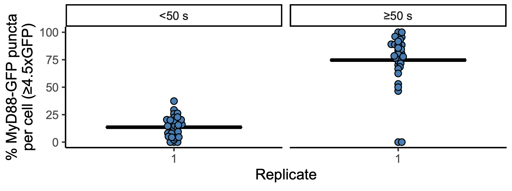
* *ProteinName* Mean_MaxIntCatPct Cat_Lifetime By_Replicate Beeswarm *Date*.pdf/svg
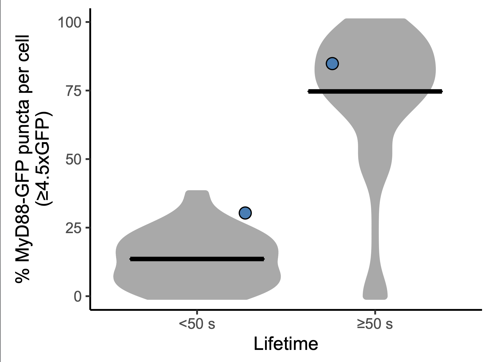
* *ProteinName* Mean_MaxIntCatPct Cat_Lifetime Violin *Date*.pdf/svg
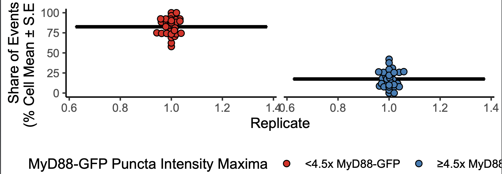
* *ProteinName* Mean_MaxIntCatPct Cat_MaxIntCat Beehive *Date*.pdf/svg

* *ProteinName* Mean_MaxIntCatPct Cat_MaxIntCat Violin *Date*.pdf/svg

#### ColocalizationSetup.R
Compares puncta that were and weren't colocalized. Among the parameters examined were the max intensity, change in intensity, and lifetime.

##### Input
* A sheet called "distance" in a file called **supporting_track_data.xlsx** located inside a folder whose path is "~/ImageAnalysisWorkflow/08_Analysis/Cohort/ImageName/Cell_N/Protein2_Protein1"

* A table called **ManualWaitTime.csv** which contains the following:
| LIGAND_DENSITY | LIGAND_DENSITY_CAT | IMAGE | CELL | PROTEIN1_NAME | PROTEIN2_NAME | PROTEIN1_TRACK_MIN | PROTEIN2_TRACK_MIN | NOTES | USER | CURATED_DELTA_T | SUPER_ID |
|-|-|-|-|-|-|-|-|-|-|-|-|
| 37.5129132 | 32 | MyD88-GFP IRAK4-mScarlet 001 | 1 | MyD88 | IRAK4 | 3 | 9 |  | Marcus | 11 | MyD88-GFP IRAK4-mScarlet 001…1…MyD88…3 |
| 37.5129132 | 32 | MyD88-GFP IRAK4-mScarlet 001 | 1 | MyD88 | IRAK4 | 28 | 22 |  | Marcus | 8 | MyD88-GFP IRAK4-mScarlet 001…1…MyD88…28 |
| 37.5129132 | 32 | MyD88-GFP IRAK4-mScarlet 001 | 1 | MyD88 | IRAK4 | 41 | 29 |  | Marcus | 5 | MyD88-GFP IRAK4-mScarlet 001…1…MyD88…41 |

##### Run
```
# If TRUE (T), it generates a refomratted table
# based on the output of 07_Colocalization
GENERATE_NEW_TABLE = F

# Limit of the max intensity plot
MAX_INT_LIMIT = 30

# A manually curated table of the wait times between two colocalized puncta
# Must be a csv and end in ".csv"
WAIT_TIME_TABLE = "ManualWaitTime.csv"
   
```

##### Output
* InputColocalization.csv.gz, a table adaption of InputData (generated by **Setup.R**) listing what images are to be analyzed
* ReformattedColocalization.csv.gz, an adaption of **supporting_track_data.xlsx** produced by **run_trackmate_anaylsis.m**. Output contained in the cell folder. Sample output table shown below:

| PROTEIN1_NAME | PROTEIN1_TRACK | PROTEIN2_NAME | PROTEIN2_TRACK | UNIVERSAL_TRACK_ID_1 | UNIVERSAL_TRACK_ID_2 | COLOCALIZATION_GROUP |
|-|-|-|-|-|-|-|
| IRAK1 | 0 | MyD88 | 16 | MyD88-GFP IRAK1-mScarlet 001...1...IRAK1...0 | MyD88-GFP IRAK1-mScarlet...1...MyD88...16 | 1 |
| IRAK1 | 0 | MyD88 | 20 | MyD88-GFP IRAK1-mScarlet...1...IRAK1...0 | MyD88-GFP IRAK1-mScarlet...1...MyD88...20 | 1 |
| IRAK1 | 0 | MyD88 | 29 | MyD88-GFP IRAK1-mScarlet...1...IRAK1...0 | MyD88-GFP IRAK1-mScarlet...1...MyD88...29 | 1 |

* GrandTableReformatedColocalization.csv.gz, all **ReformattedColocalization.csv.gz** merged
* ColocalizationAnalysis.csv.gz, the analysis of the colocalization data. Output contained in the image folder. Sample output table shown below:

| COLOCALIZATION_GROUP | COLOCALIZATION | TRACK_ID | FRAME | FRAME_LAND | FPS | LIFETIME | TOTAL_FRAMES | LIGAND_DENSITY | LIGAND_DENSITY_CAT | PROTEIN | GROUP | COHORT | IMAGE | CELL | AREA | MAX_INTENSITY_THRESHOLD | LIFETIME_THRESHOLD | STARTING_INTENSITY_THESHOLD | PROTEIN_INTENSITY | PROTEIN_BACKGROUND | MAX_NORMALIZED_INTENSITY | MAX_TOTAL_INTENSITY_WO_BACKGROUND | MAX_NORMALIZED_INTENSITY_INTEGER | STARTING_NORMALIZED_INTENSITY | ENDING_NORMALIZED_INTENSITY | MAX_INTENSITY_FRAME | MAX_INTENSITY_CAT | FRAME_MAX_INTENSITY_CAT | START_TO_MAX_INTENSITY | MAX_TO_END_INTENSITY | LIFETIME_CAT | STARTING_NORMALIZED_INTENSITY_INTEGER | STARTING_NORMALIZED_INTENSITY_CAT | CATS_COMBINED | LABEL | UNIVERSAL_TRACK_ID |
|-|-|-|-|-|-|-|-|-|-|-|-|-|-|-|-|-|-|-|-|-|-|-|-|-|-|-|-|-|-|-|-|-|-|-|-|-|
| 1 | 1 | 0 | 266 | 0 | 1 | 111 | 105 | 32.928719 | 32 | IRAK1 | MyD88 IRAK1 | MyD88 IRAK1 | MyD88-GFP IRAK1-mScarlet | 1 | 54.918 | 2.67 | 25 | 1.67 | 87.442773 | 21.417975 | 7.5605426 | 661.11481 | 8 | 1.59862723 | 0.98298885 | 30 | 1 | 0 | 5.96191537 | 6.57755375 | 1 | 2 | 0 | 110 | 005.9619 (ID 0) | MyD88-GFP IRAK1-mScarlet...1...IRAK1...0 |
| 1 | 1 | 1 | 365 | 99 | 1 | 26 | 16 | 32.928719 | 32 | IRAK1 | MyD88 IRAK1 | MyD88 IRAK1 | MyD88-GFP IRAK1-mScarlet | 1 | 54.918 | 2.67 | 25 | 1.67 | 87.442773 | 21.417975 | 2.34872334 | 205.378882 | 2 | 1.5797673 | 1.03113266 | 1 | 0 | 0 | 0.76895605 | 1.31759068 | 1 | 2 | 0 | 10 | 000.7690 (ID 1) | MyD88-GFP IRAK1-mScarlet...1...IRAK1...1 |
|  | 0 | 10 | 552 | 286 | 1 | 3 | -2 | 32.928719 | 32 | IRAK1 | MyD88 IRAK1 | MyD88 IRAK1 | MyD88-GFP IRAK1-mScarlet | 1 | 54.918 | 2.67 | 25 | 1.67 | 87.442773 | 21.417975 | 1.15983988 | 101.419615 | 1 | 0.96984973 | 0.82918544 | 1 | 0 | 0 | 0.18999014 | 0.33065444 | 0 | 1 | 0 | 0 | 000.1900 (ID 10) | MyD88-GFP IRAK1-mScarlet...1...IRAK1...10 |

* GrandColocalizationComparison.csv.gz, a table of all **ColocalizationAnalysis.csv.gz** combined. Sample output table shown below:
| COLOCALIZATION_GROUP | COLOCALIZATION | TRACK_ID | FRAME | FRAME_LAND | FPS | LIFETIME | TOTAL_FRAMES | LIGAND_DENSITY | LIGAND_DENSITY_CAT | PROTEIN | GROUP | COHORT | IMAGE | CELL | AREA | FLUOROPHORE | ASSEMBLED_COMPLEX_SIZE | MAX_INTENSITY_THRESHOLD | LIFETIME_THRESHOLD | STARTING_INTENSITY_THESHOLD | PROTEIN_INTENSITY | PROTEIN_BACKGROUND | MAX_NORMALIZED_INTENSITY | MAX_TOTAL_INTENSITY_WO_BACKGROUND | STARTING_NORMALIZED_INTENSITY | ENDING_NORMALIZED_INTENSITY | MAX_INTENSITY_FRAME | MAX_INTENSITY_CAT | FRAME_MAX_INTENSITY_CAT | START_TO_MAX_INTENSITY | MAX_TO_END_INTENSITY | LIFETIME_CAT | STARTING_NORMALIZED_INTENSITY_INTEGER | STARTING_NORMALIZED_INTENSITY_CAT | CATS_COMBINED | LABEL | UNIVERSAL_TRACK_ID | CELLX | IMAGEX | IMAGENUMBER |
|-|-|-|-|-|-|-|-|-|-|-|-|-|-|-|-|-|-|-|-|-|-|-|-|-|-|-|-|-|-|-|-|-|-|-|-|-|-|-|-|-|
|  | 0 | 105 | 458 | 282 | 1 | 8 | 2 | 37.5129132 | 32 | MyD88 | MyD88 IRAK4 | MyD88 IRAK4 | MyD88-GFP IRAK4-mScarlett 002 | 1 | 182.974 | GFP | 6 | 4.5 | 50 | 2.5 | 86.7869775 | 18.1584545 | 4.01085932 | 366.248812 | 3.22508111 | 3.0053165 | 1 | 0 | 0 | 0.78577821 | 1.00554282 | 0 | 3 | 1 | 1 | 000.7858 (ID 105) | MyD88-GFP IRAK4-mScarlett 002...1...MyD88...105 | 1 | 1 | 1 |
| 1 | 1 | 42 | 280 | 104 | 1 | 103 | 93 | 37.5129132 | 32 | MyD88 | MyD88 IRAK4 | MyD88 IRAK4 | MyD88-GFP IRAK4-mScarlett 002 | 1 | 182.974 | GFP | 6 | 4.5 | 50 | 2.5 | 86.7869775 | 18.1584545 | 5.05248877 | 456.648684 | 1.55142284 | 1.35751465 | 72 | 1 | 0 | 3.50106593 | 3.69497412 | 1 | 2 | 0 | 110 | 003.5011 (ID 42) | MyD88-GFP IRAK4-mScarlett 002...1...MyD88...42 | 1 | 1 | 1 |
| 2 | 1 | 14 | 262 | 105 | 1 | 3 | -2 | 37.5129132 | 32 | IRAK4 | MyD88 IRAK4 | MyD88 IRAK4 | MyD88-GFP IRAK4-mScarlett 002 | 29 | 106.738 | mScarlet | 4 | 3 | 20 | 1.67 | 87.5601896 | 22.0434545 | 1.65469672 | 166.929013 | 1.19653097 | 1.65469672 | 2 | 0 | 0 | 0.45816575 | 0 | 0 | 1 | 0 | 0 | 000.4582 (ID 14) | MyD88-GFP IRAK4-mScarlett 002...29...IRAK4...14 | 29 | 1 | 1 |

* A folder whose path is "~/ImageAnalysisWorkflow/08_Analysis/Colocalization". It contains:
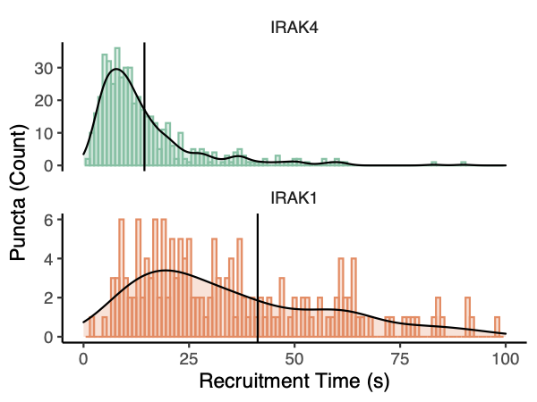
    * WaitTime Histogram *Date*.pdf, a histogram plot of the wait time
    * WaitTimeMean.csv.gz, a table of the histogram averages
    * Subfolders following the convention *Protein1_Protein2 Ligand_Density_Category* which contains the following plots:

        * *ProteinName* MaxInt Density *Date*.pdf/svg
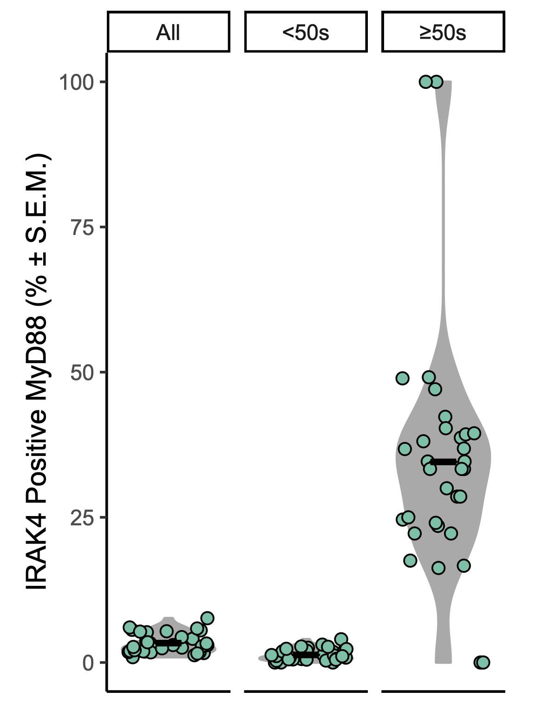
        * *ProteinName* Mean_Colocalization Cat_Lifetime By_Replicate Violin *Date*.pdf/svg
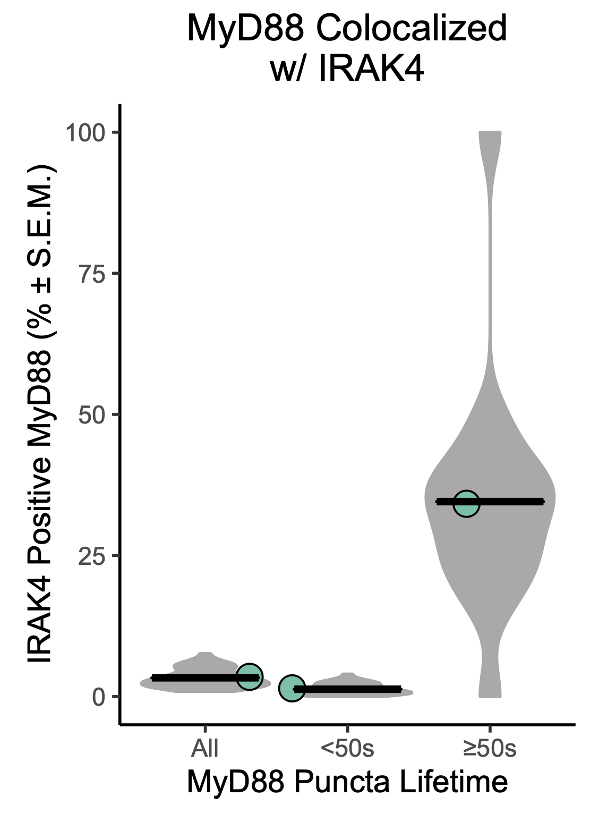
        * *ProteinName* Mean_Colocalization Cat_Lifetime Violin *Date*.pdf/svg
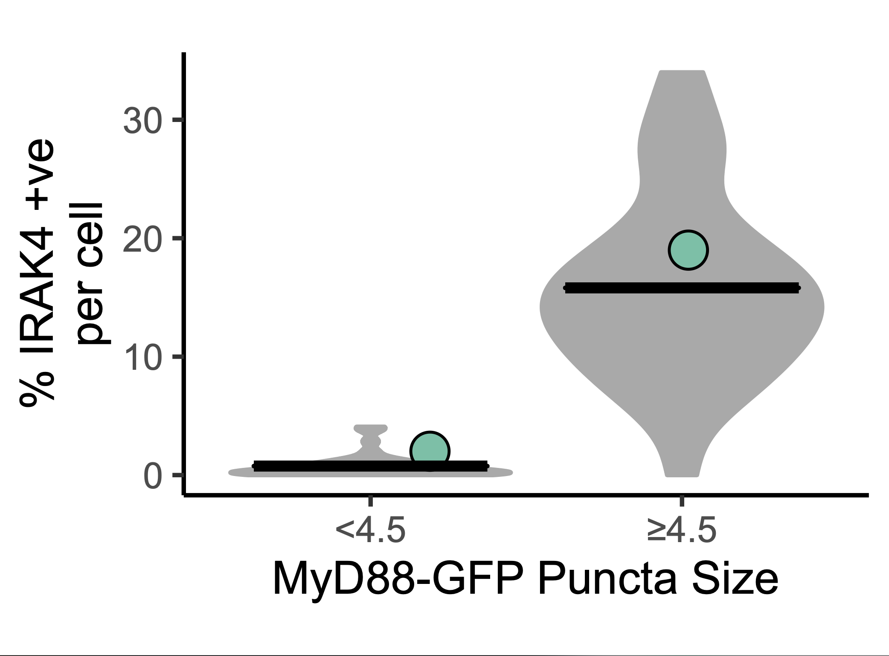
        * *ProteinName* Mean_Colocalization Cat_MaxInt Violin *Date*.pdf/svg
        * *ProteinName* Mean_Colocalization Cat_Lifetime By_Cells.csv.gz, a table of the mean percent colocalized by lifetime category grouped by cell
        * *ProteinName* Mean_Colocalization Cat_Lifetime By_Imgs.csv.gz, a table of the mean percent colocalized by lifetime category grouped by image
        * *ProteinName* Mean_Colocalization Cat_Lifetime By_Group.csv.gz, a table of the mean percent colocalized by lifetime category grouped by group
        * *ProteinName* Mean_Colocalization Cat_MaxInt By_Cells.csv.gz, a table of the mean max intensity by lifetime category grouped by cell
        * *ProteinName* Mean_Colocalization Cat_MaxInt By_Imgs.csv.gz, a table of the mean max intensity by lifetime category grouped by image
        * *ProteinName* Mean_Colocalization Cat_MaxInt By_Group.csv.gz, a table of the mean max intensity by lifetime category grouped by group
        
#### KOSetup.R
This compares single channel data among each group

##### Input
A table called **GrandTableTracks.csv.gz** generated by **FinalSummarySetup.R**

##### Run
```
#Minimum number of frames for each cell
FRAME_LAND_MIN = 500

#New table of groups combined
GENERATE_NEW_TABLE = T
```
##### Output
* InputKO.csv.gz, a list of files included in this analysis
* InputProteinKO.csv.gz, a list of files included in this analysis
* GrandTracksKO.csv.gz, a table filtering **GrandTableTracks.csv.gz** to those limited by the KO analysis, as well as meeting a cell lifetime criteria defined as `FRAME_LAND_MIN` 
* Mean_MaxInt By_Cell.csv.gz, a table of the mean max intensity by cell
* Mean_MaxInt By_Img.csv.gz, a table of the mean max intensity by image
* Mean_MaxInt By_Group.csv.gz, a table of the mean max intensity by group
* Mean_MaxIntCatPct By_Cell.csv.gz,  a table of the proportion meeting a max intensity threshold by cell
* Mean_MaxIntCatPct By_Img.csv.gz,  a table of the proportion meeting a max intensity threshold by image
* Mean_MaxIntCatPct By_Group.csv.gz, a table of the proportion meeting a max intensity threshold by group
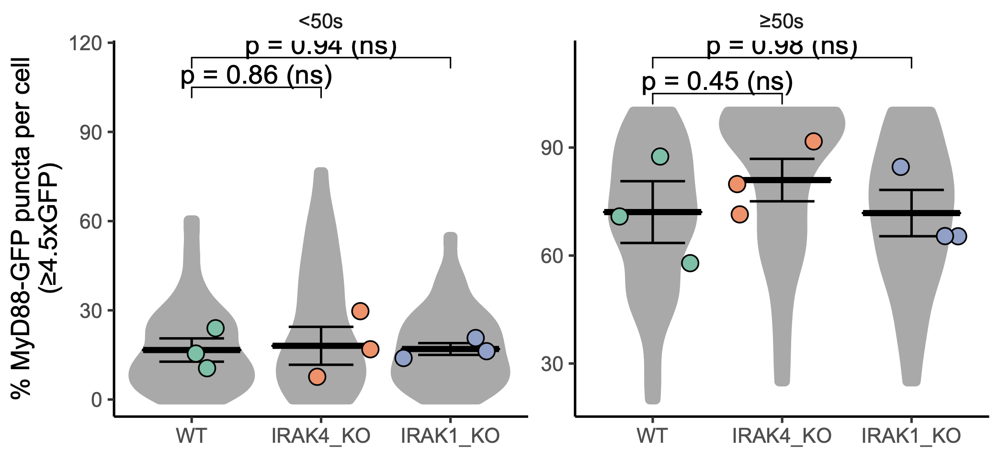
* Mean_MaxIntCatPct Cat_Lifetime *Date*.pdf/svg

* Mean_MaxIntCatPct Violin *Date*.pdf/svg

* Lifetime Histogram *Date*.pdf/svg
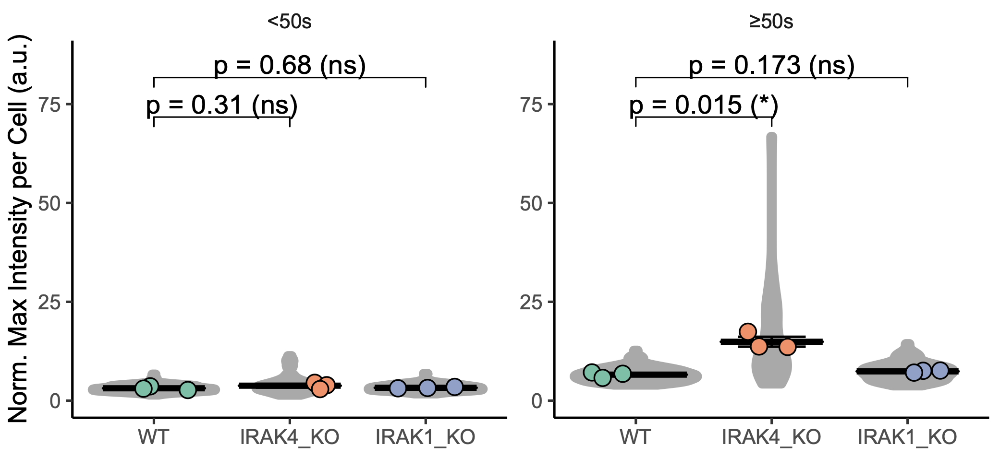
* Mean_MaxInt Cat_Lifetime *Date*.pdf/svg

* *ProteinName* Delta-Lifetime 2DHistogram *Date*.pdf/svg

#### VideoSetup.R
Makes a video of various parameters of a cell

##### Input
* Inside the file path of a cell, in a subfolder called "Stack", frames saved into individual TIFFs, padded with 0's to make it 4 characters wide (e.g., Frame 1 is 0001.tif)

##### Run
```
#Image settings
VIDEO_IMAGE = "201900503  201900503 cl028 MyD88gfp  il1 JF646 1 1000 4.4nM.n003"
VIDEO_CELL = 4
VIDEO_PROTEIN = "MyD88"

#Separate frames into individual TIFFs
#Pad with 0's to make it 4 characters wide (e.g., Frame 1 is 0001.tif)
#Save inside a subfolder called "Stack"

#From ImageJ
IMG_MIN_INTENSITY = 9 #a.u.
IMG_MAX_INTENSITY = 64 #a.u.

#Frame rate for
VIDEO_FRAME_RATE = 15
```
##### Output
* *ProteinName*.mp4, a video of the analysis calculated in real-time
* Inside the file path of a cell, in a subfolder called "Animation", a .png with the same number as the .tif file (e.g., 0001.tif will be analyzed and exported as 0001.png) 
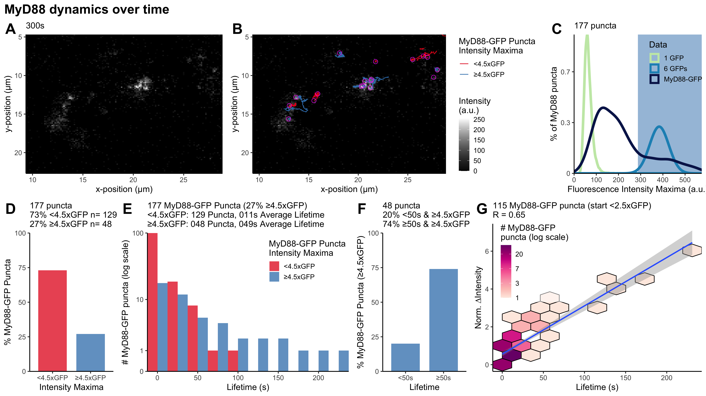

## Versioning
We use GitLab for versioning.

## Authors
* Rafael Deliz-Aguirre - All scripts
* Kabir Husain - Reextract intensity, MATLAB colocalization script, as used in:
    * Taylor, M. J., Husain, K., et al. (2017). A DNA-based T cell receptor reveals a role for receptor clustering in ligand discrimination. Cell, 169(1), 108-119.
* Alexander Schmidt - MATLAB colocalization scripts